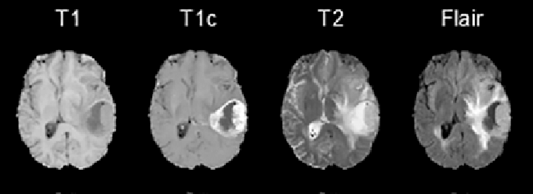

# Brain Tumor Segmentation with UNet

This repository contains the implementation of a UNet-based neural network for brain tumor segmentation in MRI images.

## Overview

The UNet architecture has been widely adopted in medical image segmentation tasks due to its effectiveness in capturing detailed features and spatial information. This implementation leverages UNet to accurately segment brain tumors from MRI scans
by Flair type and Axial Position.

## Requirements

- Python 3.11
- NumPy
- glob 
- tqdm 
- sklearn
- TensorFlow
- Keras
- albumentations 

## Usage

1. Install dependencies:

pip install tensorflow keras numpy matplotlib opencv-python glop

## Dataset

The model was trained and evaluated on the [Assiut Hospital], which provides MRI scans along with ground truth annotations for brain tumor segmentation.

## Results

